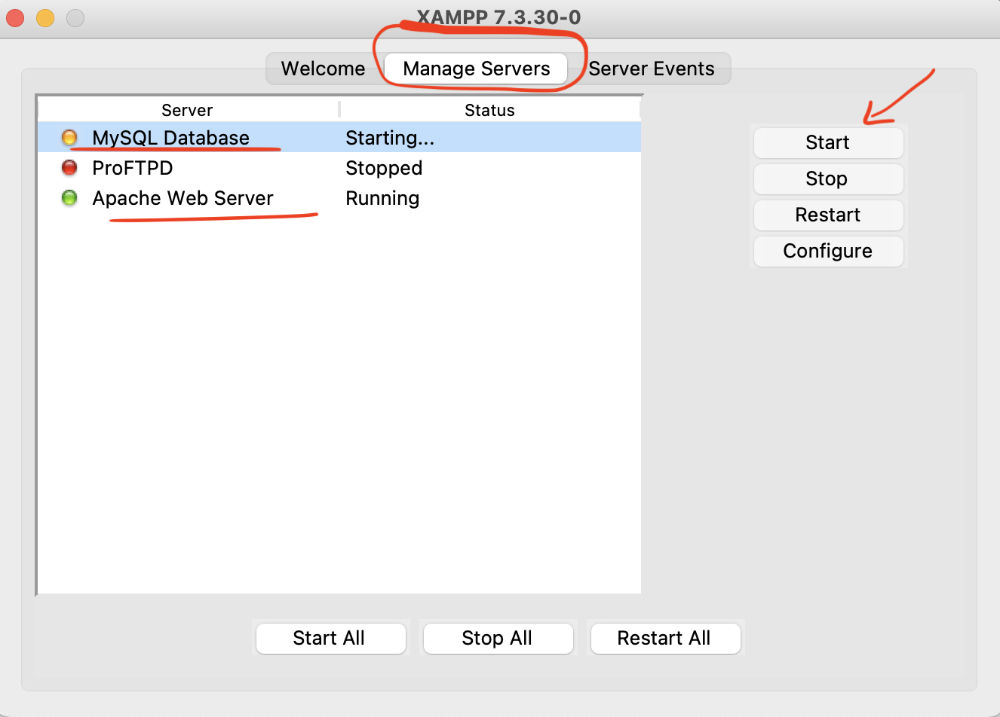
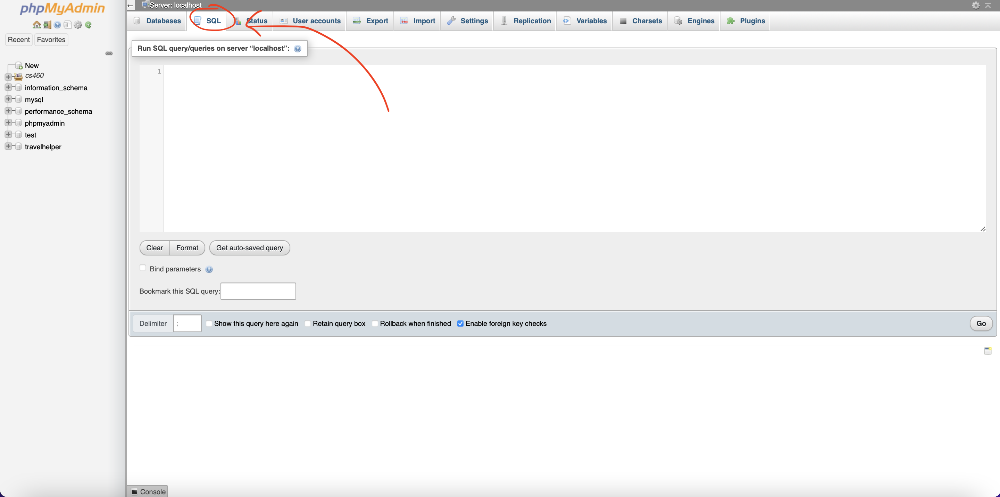

# TravelHelper

CS411 Project, Spring 2022, Lab A5 Group 4

## Database Setup 

1. Install [XAMPP](https://www.apachefriends.org/index.html)
2. Launch XAMPP. Under the 'My Servers' Tab, start  'MySQL Database' as well as 'Apache Web Server'

3. Go to [http://localhost:80](http://localhost:3000)
4. Navigate to 'phpMyAdmin' (located in the menu bar on the top right of the page)

5. Go to the 'SQL' tab

6. Copy and paste everything from schema.sql into the 'query box' and run the commands. Don't forget to click go. 

[additional help (if needed)](https://www.askpython.com/python-modules/flask/flask-mysql-database)

## Backend Setup
1. [Optional]: create a virtual environment (you really should do this!)
2. install all necessary packages from requirements.txt using pip (or pip3)
### `pip install -r requirements.txt` 
3. export flask (not sure if this is needed or not?)
		- (Mac, Linux) `export FLASK_APP=app.py`
		- (Windows) `set FLASK_APP=app.py`
4. in the terminal, run the command 
### `flask run app.py`

