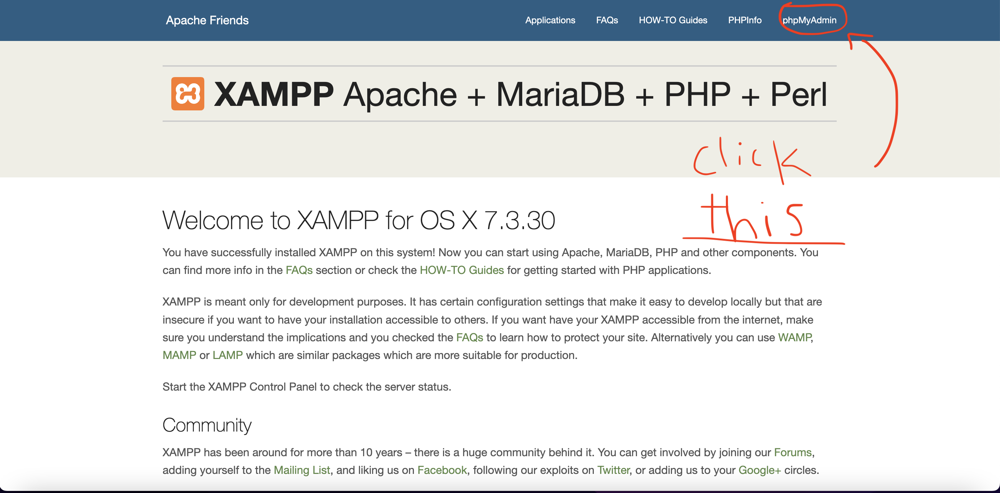

# TravelHelper

CS411 Project, Spring 2022, Lab A5 Group 4

docs folder: 
- proposal: deliverable for team assignment 1 
- user-stories: contains the user stories requried for team assingment 2 as well as revised versions of all the stories
- prototype-docs: contains all deliverables for team assignment 3
- revision-history: a description/documentation of all the changes we made to the project, including the revised user stories
- reflections-and-misc: some thoughts from the team regarding the project and some miscellaneous information about the process.
			We included this because there is no audio in the final video (video maker's mic doesn't work)

## Database Setup 

1. Install [XAMPP](https://www.apachefriends.org/index.html)
2. Launch XAMPP. Under the 'My Servers' Tab, start  'MySQL Database' as well as 'Apache Web Server'

3. Go to [http://localhost:80](http://localhost:3000)
4. Navigate to 'phpMyAdmin' (located in the menu bar on the top right of the page)

5. Go to the 'SQL' tab

6. Copy and paste everything from schema.sql into the 'query box' and run the commands. Don't forget to click go. 

[additional help (if needed)](https://www.askpython.com/python-modules/flask/flask-mysql-database)

## Backend Setup
1. [Optional]: create a virtual environment (you really should do this!)
2. install all necessary packages from requirements.txt using pip (or pip3)
	### `pip install -r requirements.txt` 
3. to startup the backend, run the following command using the terminal: 
	### `flask run app.py`

## Frontend Setup
1. enter the 'react-templates' directory
2. to startup the frontend, run the following command using the terminal:
	### `npm start`

## Hotel API
1. Retrieve a key and a secret from [Amadeus Hotel API](https://developers.amadeus.com/self-service/category/hotel/api-doc/hotel-search)
2. add the api key into 'key.txt'
3. add the api secret into 'secret.txt'
4. run api.py
